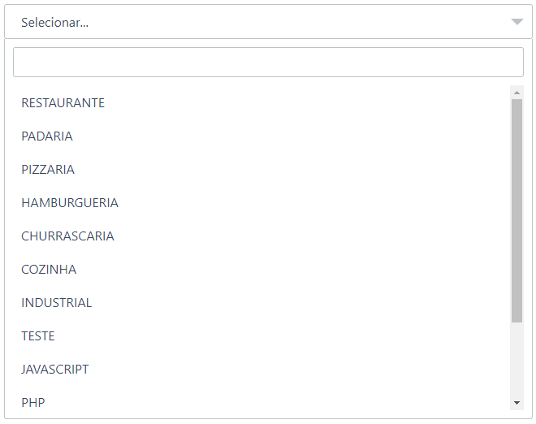

# SimpleSelect
Plugin Jquery para criar elementos select com opção de search

HTML:
~~~html
<select id="segment" name="segmentation"></select>
~~~

JavaScript
~~~javascript
var options = {
    terms: [
        'RESTAURANTE',
        'PADARIA',
        'PIZZARIA',
        'HAMBURGUERIA',
        'CHURRASCARIA',
        'COZINHA',
        'INDUSTRIAL',
        'TESTE',
        'JAVASCRIPT',
        'PHP',
        'BRAZIL',
        'CANADA',
        'MEAN'
    ]
}

$('#segment').simpleSelect(options);
~~~

### Options

| Name              | Description                                                 | Default            |
| ----------------- |:-----------------------------------------------------------:|:-------------------|
| terms             | Termos que serão renderizados dentro do select              | Array vazia `[]`   |
| notFoundMessage   | Mensagem p/ quando a pesquisa não retornar nenhum valor     | `'Não encontrado.'`|
| defaultSelected   | Texto p/ quando nenhum dos options estiver selecionado      | `'Selecionar...'`  |

[CodePen Example](https://codepen.io/jeffersonRibeiro/pen/dmGeGJ)
